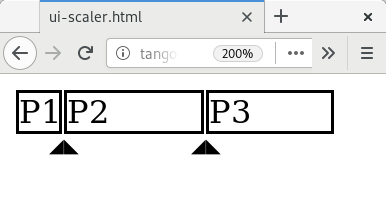

# ui-scaler.html

Copyright (C) 2019-* Jürgen "eTM" Mangler <juergen.mangler@gmail.com>

ui-scaler.html is freely distributable according to the terms of the GNU Lesser
General Public License 3.0 (see the file 'COPYING').

This code is distributed without any warranty. See the file 'COPYING' for
details.

## Introduction

ui-scaler.html is a snuggsi ツ web component that provides a small ui for
selecting the ratio between diffent concepts.



Please fork and improve!

## Dependencies

ui-scaler.html depends on

* [snuggsi ツ](https://github.com/devpunks/snuggsi)
* [jQuery](https://jquery.org/)

JQuery could be easily replace by plain javascript, if anyone is willing to put
the work in.

## Usage

Its fairly simple for now:

```html
  <!DOCTYPE html>
  <html xmlns="http://www.w3.org/1999/xhtml" lang="en" xml:lang="en">
    <head>
      <meta http-equiv="Content-Type" content="text/html; charset=utf-8"/>
      <title>ui-scaler.html</title>
      <script src=//unpkg.com/snuggsi></script>
      <link as="fetch" id="ui-scaler" rel="preload" href="ui-scaler.html"/>
    </head>
    <body is="x-ui">
      <ui-scaler data-config="10 P1;20 P2;70 P3"></ui-scaler>
    </body>
  </html>
```

To use ui-scaler.html include it (see [snuggsi
ツ](https://github.com/devpunks/snuggsi), link rel=preload), and then add
ui-scaler elements inside your body.

The attribute data-config holds a list (separated by ;) of percentages and
labels. The percentage has to be a number between 0 and 100 followd by a space
an the label (may include spaces).

In order to read the resulting ratios

```javascript
  let percentages = $('ui-scaler')[0].percentages
  console.log(percentages)

  // yields Array(3) [ 10, 20, 70 ]
```

In order to access a structured version of the original config

```javascript
  let config = $('ui-scaler')[0].config
  console.log(config)
```

## TODO

1. Add an optional [+] button to add stuff on the fly.
